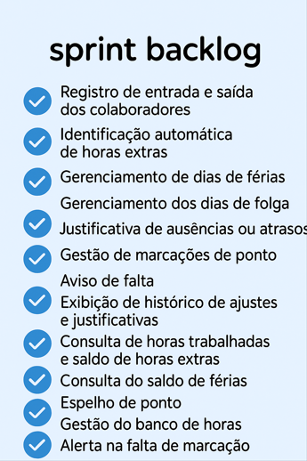
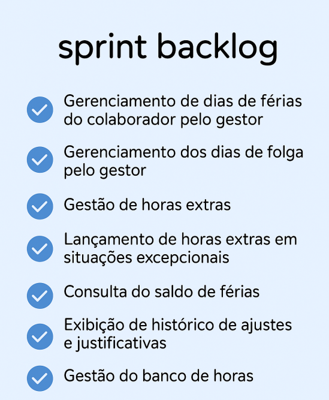

# 🕒 Checkpoint - O ponto seguro para sua jornada de trabalho! 📍

## 📌 Visão Geral
O **Checkpoint** é uma aplicação web desenvolvida para otimizar o gerenciamento de jornada de trabalho, proporcionando uma solução moderna e eficiente para o controle de ponto eletrônico. A plataforma permite registros precisos de entrada e saída, cálculo automático de horas, gestão de ausências e um painel intuitivo para análise de dados e geração de relatórios.

## ⚙️ Tecnologias Utilizadas

## 🎯 Objetivo
O objetivo do **Checkpoint** é oferecer uma solução completa para a gestão de jornada, permitindo:

✅ Registro de ponto online com diferentes métodos.

✅ Cálculo automatizado de horas trabalhadas e extras.

✅ Gestão intuitiva de ausências e folgas.

✅ Notificações e alertas para evitar esquecimentos.

✅ Relatórios detalhados e personalizados.

✅ Conformidade com normas e regulamentações.

## 🚀 Metodologia
Para o desenvolvimento do **Checkpoint**, utilizamos a metodologia ágil **Scrum**, garantindo um processo dinâmico e incremental. O backlog do produto foi definido com base nos requisitos levantados, priorizando entregas iterativas e evolutivas. O projeto é dividido em **Sprints**, com objetivos bem definidos para cada ciclo de desenvolvimento.

## 🏆 MVP (Minimum Viable Product)
### 1ª Sprint - MVP
- **Acesso do Colaborador**
- 

### 2ª Sprint - MVP
- **Acesso do Gestor/Admin**

### 3ª Sprint - MVP
- **Análise e Relatórios**

## 📖 Backlog do Produto

| ID | Requisito                            | User Story                                                                                                                                                             | Prioridade | Estimativa | Critérios de Aceitação                                                                                                                                                                                                                                                                                                                                                                                                                                                                                                                                                                                                                                                                                                                                                                                                                                                                                                                                                                                                                                                                                                                                                            |
|----|--------------------------------------|------------------------------------------------------------------------------------------------------------------------------------------------------------------------|------------|------------|-------------------------------------------------------------------------------------------------------------------------------------------------------------------------------------------------------------------------------------------------------------------------------------------------------------------------------------------------------------------------------------------------------------------------------------------------------------------------------------------------------------------------------------------------------------------------------------------------------------------------------------------------------------------------------------------------------------------------------------------------------------------------------------------------------------------------------------------------------------------------------------------------------------------------------------------------------------------------------------------------------------------------------------------------------------------------------------------------|
| 1  | Registro de entrada e saída dos colaboradores | Eu, como colaborador, quero registrar minha entrada e saída para saber o quanto trabalhei no dia.                                                              | ALTA       | 5          | "- O sistema deve registrar o horário exato   - O sistema deve registrar o horário de entrada, pausa, retomada e saída   - O sistema deve impedir registros duplicados no mesmo período   - O sistema deve exibir o tempo gasto em cada atividade   - O sistema deve adaptar o fuso horário do funcionário para o horário padrão de São Paulo"                                                                                                                                                                                                                                                                                                                                                                                                                                                                                                                                                                                                                                                                                                                                                                                                                                                                                                                                                                                                                                                                                                                                                                     |
| 2  | Identificação automática de horas extras    | Eu, como colaborador, quero que minhas horas extras sejam registradas automaticamente, com base na minha jornada programada, para que eu possa visualizar corretamente o tempo adicional trabalhado | ALTA       | 3          | "- O sistema deve calcular automaticamente as horas extras com base na jornada programada   - O colaborador deve ser notificado"                                                                                                                                                                                                                                                                                                                                                                                                                                                                                                                                                                                                                                                                                                                                                                                                                                                                                                                                                                                                                                                                                                                                                                                                                                                                                                                                                                                                              |
| 3  | Lançamento de horas extras em situações excepcionais | Eu, como gestor, quero lançar manualmente horas extras em situações excepcionais, para que a empresa tenha um acompanhamento correto das horas trabalhadas                | ALTA       | 5          | "- O sistema deve permitir o lançamento de horas extras após o dia em que foi realizado pelo colaborador   - O colaborador deve ser notificado"                                                                                                                                                                                                                                                                                                                                                                                                                                                                                                                                                                                                                                                                                                                                                                                                                                                                                                                                                                                                                                                                                                                                                                                                                                                                                                                                                                                                                     |
| 4  | Gerenciamento de dias de férias         | Eu, como colaborador, quero gerenciar meus dias de férias, para eu planejar minha viagem para Acapulco                                                              | ALTA       | 13         | "- O sistema deve exibir o saldo de férias do colaborador   - O sistema deve oferecer a possibilidade de abonar até 10 dias de férias   - O sistema deve permitir apenas 3 períodos de férias por ano   - O colaborador deve selecionar as datas desejadas para férias   - O período mínimo de férias deve ser de 14 dias   - O sistema deve excluir automaticamente fins de semana e feriados ao contabilizar os dias de férias   - Caso as férias terminem em dia não útil, o sistema deve considerar o retorno do colaborador no próximo dia útil   - O sistema deve permitir que o colaborador justifique (ou coloque uma observação) sobre o pedido de férias" |
| 5  | Gerenciamento de dias de férias do colaborador pelo gestor | Eu, como gestor, quero receber, analisar e aprovar solicitações de férias, para garantir o correto controle do saldo de férias dos colaboradores                      | ALTA       | 8          | "- O sistema deve exibir todas as solicitações de férias pendentes   - O gestor pode aceitar ou rejeitar a solicitação, na qual ele poderá deixar um comentário   - O sistema deve notificar o colaborador sobre a decisão"                                                                                                                                                                                                                                                                                                                                                                                                                                                                                                                                                                                                                                                                                                                                                                                                                                                                                                                                                                                                                                                                                                                                                                                                                                                                                                                                                                                                       |
| 6  | Gerenciamento dos dias de folga          | Eu, como colaborador, quero poder agendar meus dias de folgas, para que eu possa descansar um pouco                                                                    | ALTA       | 8          | "- O sistema deve permitir que o colaborador agende suas folgas   - O sistema deve permitir que o colaborador edite seu pedido ou o exclua   - O sistema deve permitir que o colaborador justifique um pedido de folga   - O sistema deve notificar o gestor em caso de pedido de folga   - O sistema não deve permitir que o colaborador agende folga no caso do uso de banco de horas, se ele não tiver horas suficientes para isso   - O saldo de hora deve ser zerado de seis em seis meses (de janeiro à junho/de julho à dezembro)"                                                                                                                                                                                                                                                                                                                                                                                                                                                                                                                                                                                                                                                                                                                                                                                                                                                                               |
| 7  | Gerenciamento dos dias de folga pelo gestor | Eu, como gestor, quero receber, analisar e aprovar solicitações das folgas dos colaboradores, para que a empresa possa se preparar melhor para esse evento            | ALTA       | 13         | "- O sistema deve exibir todas as solicitações de folgas pendentes   - O gestor pode aceitar ou rejeitar a solicitação, na qual ele poderá deixar um comentário   - O sistema deve notificar o colaborador sobre a decisão"                                                                                                                                                                                                                                                                                                                                                                                                                                                                                                                                                                                                                                                                                                                                                                                                                                                                                                                                                                                                                                                                                                                                                                                                                                                                                                                                                                                                       |
| 8  | Justificativa de ausências ou atrasos     | Eu, como colaborador, quero justificar minhas ausências ou atrasos por meio do envio de justificativas para não sofrer penalidades                                    | ALTA       | 8          | "- O sistema deve permitir o envio de documentos comprobatórios das faltas ou atrasos   - O sistema deve permitir o envio de justificativa por escrito   - O sistema deve identificar os dias em que o usuário tem alguma falta e mostrá-lo na interface   - Faltas como atraso por perda de hora (dormiu mais, trânsito), mal estar sem ir ao médico entre outros não precisam de documento comprobatório, apenas uma justificativa por escrito"                                                                                                                                                                                                                                                                                                                                                                                                                                                                                                                                                                                                                                                                                                                                                                                                                                                                                                                                                                                     |
| 9  | Ajuste no ponto                       | Eu, como gestor ou administrador, quero poder corrigir erros de marcação de ponto, para garantir que o registro de jornada dos funcionários esteja correto após a validação | ALTA       | 8          | "- O sistema deve permitir a edição ou inclusão de novas marcações   - O sistema deve permitir que os ajustes possam ser feitos após a validação   - O colaborador deve ser notificado sobre ajustes feitos em seu ponto   - O sistema deve permitir que o colaborador solicite uma mudança em seu registro de ponto, na qual ele pode enviar uma justificativa"                                                                                                                                                                                                                                                                                                                                                                                                                                                                                                                                                                                                                                                                                                                                                                                                                                                                                                                                                                                                                                                                                                                                                |
| 10 | Configuração das jornadas de trabalho     | Eu, como gestor, quero configurar diferentes tipos de jornadas de trabalho, incluindo turnos, escalas e jornadas, para garantir que os horários dos funcionários estejam alinhados com as regras de empresa | ALTA       | 8          | "- O sistema deve permitir a definição de diferentes tipos de jornadas (fixa, ex.: das 9h às 18h; flexível. ex.: distribuir suas horas ao longa da semana, desde que cumpra a carga horária total)   - O gestor pode definir os horários dos turnos da manhã, tarde e noite   - O gestor pode definir escalas personalizadas (6x1, 12x36 etc)   - O admin pode definir escalas específicas para estagiários"                                                                                                                                                                                                                                                                                                                                                                                                                                                                                                                                                                                                                                                                                                                                                                                                                                                                                                                                                                                         |
| 11 | Gestão de horas extras                  | Eu, como gestor, quero ajustar, aprovar, incluir ou rejeitar os registros de hora extra, para que eu possa gerenciar corretamente a jornada dos funcionários         | ALTA       | 13         | "- O sistema deve permitir a visualização das horas extras acumuladas por funcionário   - O sistema deve permitir que o gestor aprove, rejeite ou ajuste horas extras   - O funcionário deve ser notificado caso sua hora extra seja aprovada, ajustada ou rejeitada   - O sistema deve zerar o saldo de horas acumuladas do funcionário a cada seis meses, de janeiro à junho/ julho à dezembro"                                                                                                                                                                                                                                                                                                                                                                                                                                                                                                                                                                                                                                                                                                                                                                                                                                                                                                                                                                                                    |
| 12 | Gestão de marcações de ponto            | Eu, como colaborador, quero poder gerenciar minhas marcações de ponto por visualizar marcações já registradas e ajustar erros, para que eu possa cumprir com minha jornada de trabalho | ALTA       | 5          | "- O sistema deve exibir marcações de datas passadas   - O sistema deve permitir que o colaborador solicite uma edição na marcação de ponto ao gestor   - O sistema deve permitir que o colaborador solicite uma exclusão na marcação de ponto ao gestor"                                                                                                                                                                                                                                                                                                                                                                                                                                                                                                                                                                                                                                                                                                                                                                                                                                                                                                                                                                                                                                                                                                                                                                                                                                                                             |
| 13 | Aviso de falta                        | Eu, como colaborador, quero ser avisado de uma falta que não justifiquei, para que eu não me esqueça de fazê-lo                                                             | ALTA       | 5          | "- O sistema deve exibir uma notificação ao colaborador que não justificou uma falta   - O sistema deve registrar a falta após 10 minutos de atraso ao marcar o ponto"                                                                                                                                                                                                                                                                                                                                                                                                                                                                                                                                                                                                                                                                                                                                                                                                                                                                                                                                                                                                                                                                                                                                                                                                                                                                                                                                                                                               |
| 14 | Exibição de histórico de ajustes e justificativas | Eu, como colaborador, quero visualizar o histórico de ajustes feitos em minhas marcações e as justificativas aplicadas, para entender eventuais correções na minha jornada | ALTA       | 5          | "- O sistema deve exibir o histórico de todos os ajustes de marcações   - O sistema deve exibir as justificativas dos ajustes"                                                                                                                                                                                                                                                                                                                                                                                                                                                                                                                                                                                                                                                                                                                                                                                                                                                                                                                                                                                                                                                                                                                                                                                                                                                                                                                                                                                                                             |
| 15 | Consulta de horas trabalhadas e saldo de horas extras | Eu, como colaborador, quero visualizar meu total de horas trabalhadas e meu saldo de horas extras para entender quanto tempo extra acumulei e como ele será utilizado | ALTA       | 5          | "- O sistema deve exibir o saldo de horas extras totais do mês atual e dos anteriores   - O sistema deve exibir o total de horas trabalhadas do mês atual e dos anteriores"                                                                                                                                                                                                                                                                                                                                                                                                                                                                                                                                                                                                                                                                                                                                                                                                                                                                                                                                                                                                                                                                                                                                                                                                                                                                                                                                                                                                |
| 16 | Consulta do saldo de férias            | Eu, como colaborador, quero consultar meu saldo de férias para saber quantos dias disponíveis tenho e planejar meu descanso                                                   | ALTA       | 5          | "- O sistema deve exibir o saldo de férias do colaborador   - O sistema deve exibir os saldos de férias anteriores do colaborador"                                                                                                                                                                                                                                                                                                                                                                                                                                                                                                                                                                                                                                                                                                                                                                                                                                                                                                                                                                                                                                                                                                                                                                                                                                                                                                                                                                                                              |
| 17 | Espelho de ponto                      | Eu, como colaborador, quero gerar um relatório com dados detalhados sobre minhas marcações, horas extras e outras anotações para aprovação e conferência                | Média      | 13         | "- O colaborador deve poder filtrar um período específico para gerar o relatório   - O sistema deve permitir que o admin também tenha acesso ao espelho de pontos dos colaboradores   - O admin pode gerar relatório de um colaborador específico ou de todos os colaboradores   - O colaborador deve poder baixar seu relatório em formato de pdf   - O sistema deve gerar relatórios com dados de marcações, horas extras e faltas do período selecionado"                                                                                                                                                                                                                                                                                                                                                                                                                                                                                                                                                                                                                                                                                                                                                                                                                                                                                                                                                                                                |
| 18 | Geração de relatórios das ausências dos colaboradores | Eu, como gestor, quero gerar um relatório sobre as ausências cometidas pelo colaborador, para que possa tomar as medidas necessárias                               | Média      | 5          | "- O sistema deve permitir a filtragem das ausências por colaborador   - O sistema deve permitir a filtragem das ausências por período   - O sistema deve permitir a geração de um relatório completo sobre as ausências"                                                                                                                                                                                                                                                                                                                                                                                                                                                                                                                                                                                                                                                                                                                                                                                                                                                                                                                                                                                                                                                                                                                                                                                                                                                                                                                                                                                                |
| 19 | Geração de relatórios das marcações feitas em um dia | Eu, como gestor, quero visualizar um relatório sobre as marcações feitas em um dia específico, para facilitar o acompanhamento da presença dos colaboradores          | Média      | 5          | "- O sistema deve permitir a filtragem de um dia específico   - O sistema deve permitir a filtragem por colaborador específico   - O sistema deve mostrar um relatório de todos os colaboradores naquele dia específico"                                                                                                                                                                                                                                                                                                                                                                                                                                                                                                                                                                                                                                                                                                                                                                                                                                                                                                                                                                                                                                                                                                                                                                                                                                                                                                                                                               |
| 20 | Gestão do banco de horas               | Eu, como colaborador, quero acessar relatórios detalhados sobre meu saldo de banco de horas, incluindo horas extras, acumuladas, descontos e compensações, para entender meu saldo disponível | Média      | 8          | "- O colaborador deve conseguir visualizar seu saldo atualizado e o histórico de compensação   - O gestor deve ter acesso a um relatório detalhado com filtros por período e colaborador   - O sistema deve possibilitar a exportação dos relatórios"                                                                                                                                                                                                                                                                                                                                                                                                                                                                                                                                                                                                                                                                                                                                                                                                                                                                                                                                                                                                                                                                                                                                                                                                                                                                                   |
| 21 | Alerta na falta de marcação            | Eu, como colaborador, quero ser notificado se não marcar o ponto, para minimizar erros de marcação                                                                       | Média      | 5          | "- O sistema deve notificar o colaborador se ele não fizer a marcação do ponto"                                                                                                                                                                                                                                                                                                                                                                                                                                                                                                                                                                                                                                                                                                                                                                                                                                                                                                                                                                                                                                                                                                                                                                                                                                                                                                                                                                                                                                |
| 22 | Relatório de falhas de marcações        | Eu, como gestor, quero receber um relatório semanal dos colaboradores que não registram seus pontos no horário específico                                                 | Baixa      | 5          | "- O sistema deve gerar um relatório semanal dos colaboradores que não marcaram seus pontos no horários específico"                                                                                                                                                                                                                                                                                                                                                                                                                                                                                                                                                                                                                                                                                                                                                                                                                                                                                                                                                                                                                                                                                                                                                                                                                                                                                                                                                                                                          |
| 23 | Autenticação multifatorial             | Eu, como colaborador, admin e gestor, quero autenticação multifatorial para garantir que minha autenticação no sistema seja segura                                          | Baixa      | 7          | "- O sistema deve permitir o envio de um código verificador via email ao tentar logar no sistema"                                                                                                                                                                                                                                                                                                                                                                                                                                                                                                                                                                                                                                                                                                                                                                                                                                                                                                                                                                                                                                                                                                                                                                                                                                                                                                                                                                                                               |

## 📖 Backlog da 1ª Sprint (Acesso do Colaborador)

## 📖 Backlog da 2ª Sprint (Acesso do Gestor e relatórios)

## 📏 Padronização de Commits

Para manter um histórico de código organizado e padronizado, utilizamos a seguinte estrutura nos commits:

| Prefixo  | Descrição                                                              |
|----------|------------------------------------------------------------------------|
| feat     | Quando adicionamos um novo recurso ao código.                          |
| fix      | Para corrigir um bug.                                                  |
| style    | Alterações que não afetam a lógica do código (formatação, espaços, etc.). |
| refactor | Refatoração sem mudança de comportamento ou correção de bug.          |
| test     | Adicionando ou corrigindo testes.                                      |
| docs     | Mudanças apenas na documentação.                                       |
| chore    | Atualizações de ferramentas, dependências ou scripts auxiliares.       |
| perf     | Melhorias de desempenho.                                               |
| build    | Mudanças no sistema de build ou dependências.                           |

Formato dos commits:
- prefixo[ID DA TASK JIRA]: <descrição>

## 👷 Equipe de Desenvolvimento

| Função        | Nome              | GitHub                                         | LinkedIn                                                              |
|---------------|-------------------|------------------------------------------------|-----------------------------------------------------------------------|
| Scrum Master  | Gabriel Guimarães | [GitHub](https://github.com/gabrielbguimaraes) | [LinkedIn](https://www.linkedin.com/in/gabriel-g-854017138/)        |
| Product Owner | João Suzuki       | [GitHub](https://github.com/joaosuzuki98)      | [LinkedIn](https://www.linkedin.com/in/jo%C3%A3o-suzuki-6a2b02192/) |
| Developer     | Avya Alex         | [GitHub](https://github.com/AvyaAquino)        | [LinkedIn](https://www.linkedin.com/in/avya-candido-598b5228a/)     |
| Developer     | Davi Miguel       | [GitHub](https://github.com/DMBMz)             | [LinkedIn](https://www.linkedin.com/in/davi-miguel-a90821214/)      |
| Developer     | João Góes         | [GitHub](https://github.com/MagNumGomes)       | [LinkedIn](https://www.linkedin.com/in/joaovitorgoes/)              |
| Developer     | Pedro Prevides    | [GitHub](https://github.com/GalaxyBurst)       | [LinkedIn](https://www.linkedin.com/in/pedro-prevides-87a0b71a8/)   |

## 📅 Relatórios das Sprints
📌 Sprint 1 - *Loading...*

📌 Sprint 2 - *Loading...*

📌 Sprint 3 - *Loading...*
